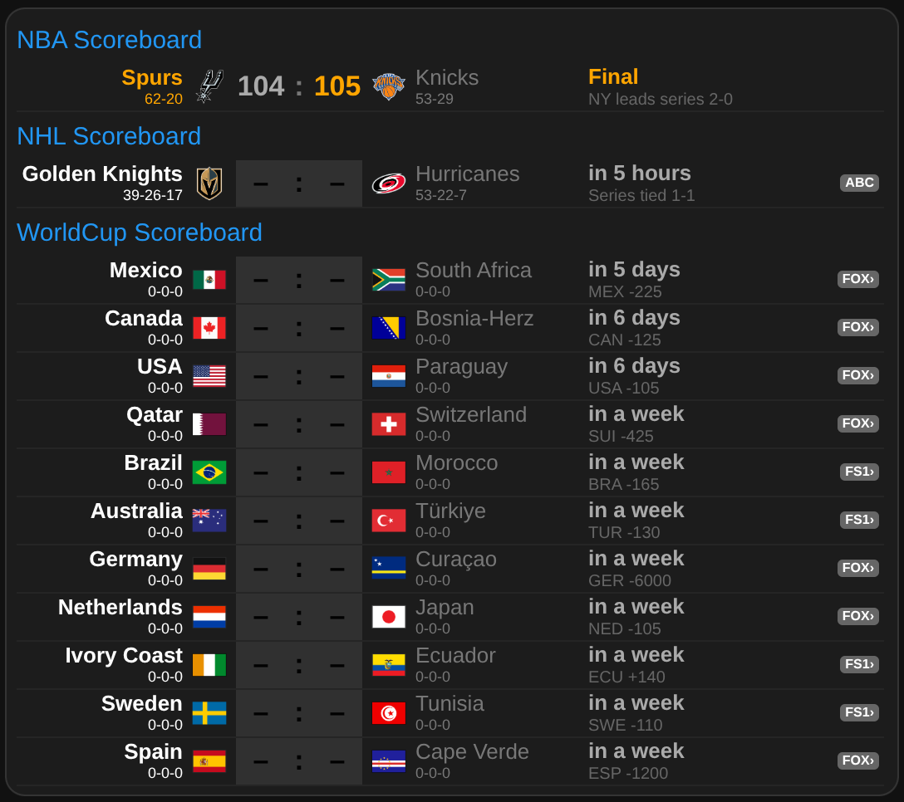

# TeamTracker Scoreboard Card



A compact, auto-generating sports scoreboard card for Home Assistant Lovelace dashboards.

Displays live scores, pre-game odds, win probability, TV network, and series info — one row per
game, grouped by sport. Built on top of the
[ha-teamtracker](https://github.com/vasqued2/ha-teamtracker) integration.

## Features

- Live scores with in-game win probability and clock
- Pre-game: countdown, odds / series summary
- Post-game: final score, winner highlighted in orange
- TV network badge on live and upcoming games
- Highlight your favourite teams in blue via `special_teams` (colour configurable)
- Single HACS install — no extra card dependencies

## Requirements

| Dependency                                                   | Type             | Notes                                         |
| ------------------------------------------------------------ | ---------------- | --------------------------------------------- |
| [ha-teamtracker](https://github.com/vasqued2/ha-teamtracker) | HACS Integration | Provides the `sensor.<sport>_<team>` entities |

### Setting up ha-teamtracker sensors

Install [ha-teamtracker](https://github.com/vasqued2/ha-teamtracker) via HACS (Integrations), then
add your team sensors to `configuration.yaml`. The sensor `name` becomes the entity ID prefix used
in this card's `prefix` field — e.g. `name: nba_bos` → `sensor.nba_bos`.

```yaml
sensor:
  # ── NBA ──────────────────────────────────────────
  # ── ATLANTIC ───────────────────────────────────────────
  - platform: teamtracker
    league_id: "NBA"
    team_id: "BOS"
    name: "nba_bos"
  - platform: teamtracker
    league_id: "NBA"
    team_id: "BKN"
    name: "nba_bkn"
  - platform: teamtracker
    league_id: "NBA"
    team_id: "NY"
    name: "nba_ny"
```

Add one entry per team you want to track. The `name` value must be unique and should follow a
consistent `<league>_<team>` pattern so the card can group them with a single `prefix`.

## Installation

### Via HACS (recommended)

1. In HACS → Frontend → click the three-dot menu → **Custom repositories**
   - Repository: `https://github.com/marcintk/ha-teamtracker-scoreboard` (exact URL)
   - Category: **Dashboard**
2. Search **TeamTracker Scoreboard Card** → Install
3. Reload your browser
4. Add the card to your dashboard (see Configuration below)

### Manual

1. Copy `dist/card.js` to `<config>/www/ha-teamtracker-scoreboard-card/card.js` (create the folder
   if needed)
2. In Home Assistant → Settings → Dashboards → Resources → **Add resource**
   - URL: `/local/ha-teamtracker-scoreboard-card/card.js`
   - Resource type: **JavaScript module**
3. Reload your browser

## Configuration

Add a **Manual card** to your dashboard and paste:

```yaml
type: custom:ha-teamtracker-scoreboard-card
sections:
  - name: NBA Scoreboard
    prefix: sensor.nba_
    limit: 10
    special_teams:
      - bos
    rankType: win-loss
  - name: NHL Scoreboard
    prefix: sensor.nhl_
    limit: 5
    special_teams:
      - dal
    rankType: win-draw-loss
  - name: World Cup
    prefix: sensor.wc_
    limit: 13
    special_teams:
      - fra
```

### Options

| Option     | Type   | Default  | Description                                   |
| ---------- | ------ | -------- | --------------------------------------------- |
| `height`   | string | auto     | Card height (CSS value); omit to fit content  |
| `sections` | list   | required | One entry per sport/league                    |
| `colors`   | map    | —        | Override team colours (see [Colors](#colors)) |

### Section options

| Field           | Type   | Default    | Description                                                                                 |
| --------------- | ------ | ---------- | ------------------------------------------------------------------------------------------- |
| `name`          | string | required   | Header label shown above the section                                                        |
| `prefix`        | string | required   | Entity ID prefix, e.g. `sensor.nba_`                                                        |
| `limit`         | number | `10`       | Max rows to show                                                                            |
| `special_teams` | list   | `[]`       | Team suffixes to highlight. Use the part after the prefix — e.g. `bos` for `sensor.nba_bos` |
| `rankType`      | string | `win-draw-loss` | How to rank teams during regular season. See below                                     |

### rankType values

| Value           | Use for                                         |
| --------------- | ----------------------------------------------- |
| `win-draw-loss` | Leagues where draws count (NHL, MLS, soccer, …) |
| `win-loss`      | Leagues with W/L records only (NBA, NFL, MLB, …)|

`rankType` only applies during the regular season. Outside it (playoffs, cups, tournaments), the
card automatically sorts by game date regardless of your setting — no `by-date` option needed.

## Colors

Set any colour directly in the card config:

```yaml
type: custom:ha-teamtracker-scoreboard-card
colors:
  team: white
  opponent: gray
  special: "#2196F3" # Material Blue — matches section headers
  header: "#2196F3" # Material Blue
  winner: orange
  loser: darkgray
  live: indianred
  leading: brown
sections:
  - ...
```

| Key        | Default                   | Description                                |
| ---------- | ------------------------- | ------------------------------------------ |
| `team`     | `white`                   | Your tracked team name                     |
| `opponent` | `#777` (gray)             | Opponent name                              |
| `special`  | `#2196F3` (Material Blue) | `special_teams` highlight                  |
| `header`   | `#2196F3` (Material Blue) | Section header label                       |
| `winner`   | `orange`                  | POST winner score and final clock          |
| `loser`    | `darkgray`                | POST loser score                           |
| `live`     | `indianred`               | IN game clock text and TV badge background |
| `leading`  | `brown`                   | IN score for the currently leading team    |

## Score row visual states

| State  | Score bg         | Score colour                       | Message area              |
| ------ | ---------------- | ---------------------------------- | ------------------------- |
| `PRE`  | dark (`#303030`) | black                              | Countdown · odds / series |
| `IN`   | light gray       | brown (leading) / black (trailing) | Clock · win %             |
| `POST` | transparent      | orange (winner) / gray (loser)     | Final clock · series      |

## Development

```bash
npm install
npm run build          # bundle src/ → dist/card.js
npm run build:prod     # minified production build
npm run dev            # watch mode
npm test               # run tests
npm run test:coverage  # run tests with coverage report
npm run check          # biome lint + format (src/ and test/)
npm run format:md      # prettier for markdown files
```

Source is in `src/`, built output is `dist/card.js`. The dist file is committed so HACS can serve it
directly without a CI build step.

### Contributing

All changes go through a pull request — push a branch and open a PR against `main`. CI runs
build, lint, and tests automatically on every PR.

### Releasing

Go to **Actions → Release → Run workflow**, enter the version number (e.g. `1.0.1`).
The workflow builds `dist/card.js`, tags the release, and publishes a GitHub Release that HACS picks up.
